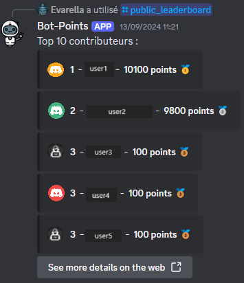

# Commande `public_leaderboard`

La commande `public_leaderboard` affiche les 10 meilleurs contributeurs d'un serveur Discord en fonction de leur solde de points.

***Quelle est la différence avec la commande `leaderboard` ?***

--> `public_leaderboard` est visible pour tout le monde, affiche les avatars mais ne tag personne

--> `leaderboard` est visible que pour celui qui a lancé la commande, n'affiche pas les avatars mais tag les personnes

## Description

Cette commande utilise Prisma pour interagir avec une base de données et récupérer les 10 utilisateurs ayant le solde de points le plus élevé. Les résultats sont affichés dans un message rempli de plusieurs embeds Discord avec des informations sur chaque utilisateur. En pied de page, il y a un bouton pour voir plus de détails sur le web.

## Utilisation

```ts
/public_leaderboard
```

## Fonctionnalités

- Affiche les 10 meilleurs contributeurs avec leur solde de points.
- Trie les utilisateurs par solde de points décroissant et par nom d'utilisateur Discord en cas d'égalité.
- Affiche un message si aucun utilisateur n'est trouvé dans la base de données.
- Utilise des emojis pour les trois premiers utilisateurs.
- Ajoute un bouton pour voir plus de détails sur le web.



## Exemple de sortie

Un ensemble de message avec les embeds Discord :

- **Contenu** : "description du contenu du message"
- **Liste d'embeds Discord** :
  - **Icône de l'auteur** : Avatar de l'utilisateur ou une image par défaut.
  - **Auteur** : `Position - Nom d'utilisateur - Solde de points` avec un emoji pour les trois premiers utilisateurs.
- **Bouton** : Lien vers le dashboard web pour plus de détails

## Remarques

- Assurez-vous que la base de données est correctement configurée et que les utilisateurs ont des soldes de points.
- La commande utilise des composants interactifs de Discord.js pour afficher les résultats et le bouton.
- Si aucun utilisateur n'est trouvé dans la base de données, un message est envoyé pour en informer l'utilisateur.
- En cas d'erreur lors de la récupération des contributeurs, un message d'erreur est envoyé.